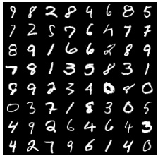

# MyLittleGAN

[DCGAN](https://arxiv.org/pdf/1511.06434.pdf) implementation to generate MNIST images.

Real MNIST Samples            |  Fake MNIST Samples
:-------------------------:|:-------------------------:
   |   

Install the sources with `poetry install`

Run tests with `python -m pytest tests/`
