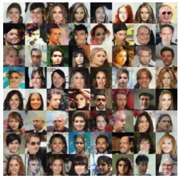

# MyLittleGAN

[DCGAN](https://arxiv.org/pdf/1511.06434.pdf) implementation to generate fake images.

Real MNIST Samples            |  Fake MNIST Samples
:-------------------------:|:-------------------------:
   |  

Real CelebA Samples            |  Fake CelebA Samples
:-------------------------:|:-------------------------:
   |   

### Running the code

Install the sources with `poetry install`.

Run tests with `python -m pytest tests/`.

Get the [CelebA](https://www.kaggle.com/jessicali9530/celeba-dataset) dataset and unzip it.

In DCGAN.ipynb change `celeba_path = "/your/path/to/img_align_celeba/"` to the adequate path.

Run the notebook.
